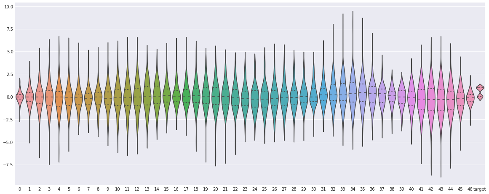
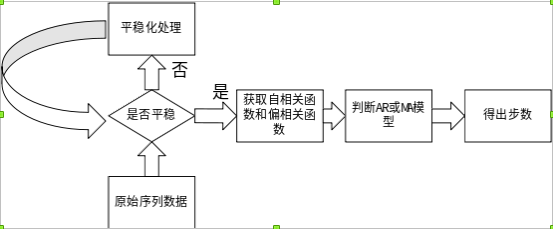
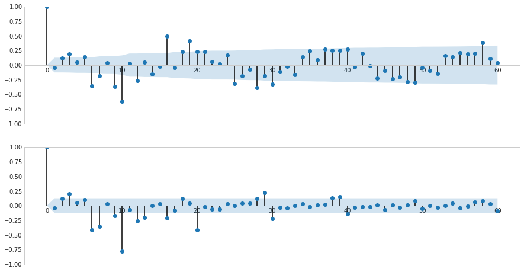
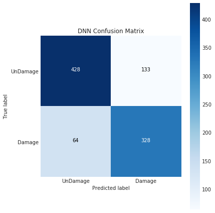
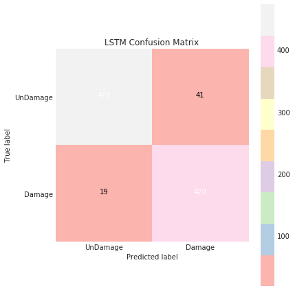
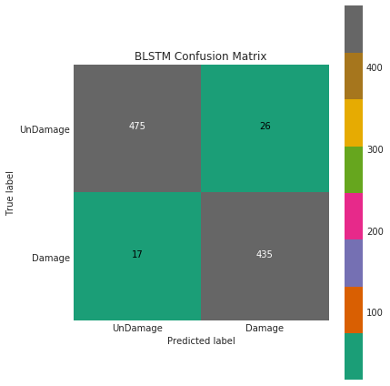
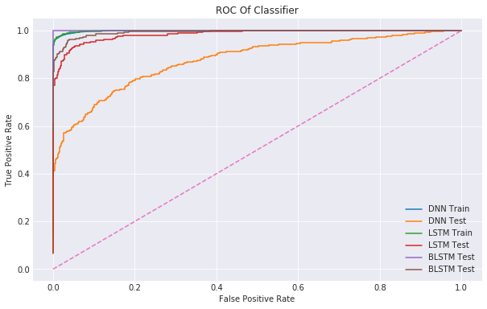

# Benchmark_recognization
一个benchmark数据的损伤识别,实验流程见：

## 数据集介绍
>spring_beam.zip includes a folder spring_beam, which includes 100 files acc_xxx.mat.
These are time series from 47 accelerometers with 2859 samples. The variable is y(47x2859).
Measurements 1-50 undamaged, 51-60 damage 1, 61-70 damage 2, 71-80 damage 3, 81-90 damage 4, 91-100 damage 5.

 

**数据琴型图如下**：
>

## 实验步骤

该实验共分为3部分

    1. 基于过滤式的特征提取（指标用信息增益率）
    2. 利用ARMA模型的自相关函数以及偏自相关函数确定LSTM步数
    3. 利用双向LSTM作损伤识别

## 1. 基于过滤式的特征提取
这里用信息增益率作为过滤式特征选择的指标。主要是考虑到结构数据很多时候离散数据和连续数据兼有，用互信息又会被类别多少左右，所以参造C4.5算法对ID3的改进，这里选择信息增益率。

用信息增益率（用熵指标应该都会遇到）面临的另一个问题就是连续数据的处理。这里有两个思路：

1. 将数据离散化，利用离散分布建模
2. 直接用连续分布建模

### 数据离散化方式

>基本参照C4.5算法的离散化方式
### 连续分布建模
>借鉴GDA的思想，直接用生成模型建模。但不一定会用高斯分布建模，在建模之前，会用卡方检验检验其分布的适用性，如果P值小于显著性水平，就换一种分布，直到零假设成立为止。在求出分布之后，即可用连续分布求出信息增益率

**最终结果**：

## 2.利用ARMA模型的ACF和PACF确定LSTM步数
借鉴于ARMA模型的其中一种定阶方式，所选模型遵循两个原则：

1. 时间复杂度尽量小（因为是采样计算，不存在空间复杂度的问题）
2. 这里的目的仅是定阶，而非建立一个ARMA模型,所选步骤尽量“轻”，换句话说，就是越不依赖ARMA模型本身越好

**阶数流程图:**

**最终结果**（上图是ACF，下图是PACF）：

## 3.损伤识别

DNN、LSTM，Bidirectional-LSTM，作横向对比(因为DNN不是时序模型，所以做了相应的特征提取)

**混淆矩阵**：

  

**ROC**:

