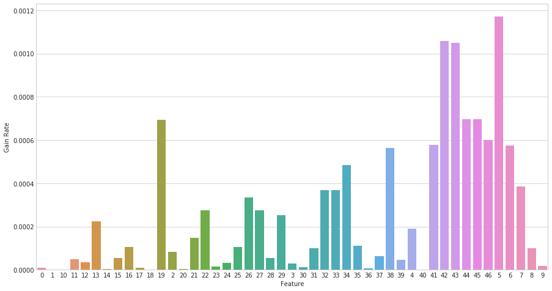

# Benchmark Recognization
一个基于benchmark数据的损伤识别,实验流程见：[BenchMark.ipynb](BenchMark.ipynb)

## 环境

* python3.6
* keras2.1
* numpy
* scikit-learn
* scipy
* seaborn
* pandas

## 数据集介绍
>spring_beam.zip includes a folder spring_beam, which includes 100 files acc_xxx.mat.
These are time series from 47 accelerometers with 2859 samples. The variable is y(47x2859).
Measurements 1-50 undamaged, 51-60 damage 1, 61-70 damage 2, 71-80 damage 3, 81-90 damage 4, 91-100 damage 5.

<br>

**数据琴型图如下**：
>

## 实验步骤

该实验共分为3部分

1. 基于过滤式的特征提取（指标用信息增益率）
2. 利用ARMA模型的自相关函数以及偏自相关函数确定LSTM步数
3. 利用双向LSTM作损伤识别


## 1. 基于过滤式的特征提取
这里用信息增益率作为过滤式特征选择的指标。主要是考虑到结构数据很多时候离散数据和连续数据兼有，用互信息又会被类别多少左右，所以参造C4.5算法对ID3的改进，这里选择信息增益率。

用信息增益率（用熵指标应该都会遇到）面临的另一个问题就是连续数据的处理。这里有两个思路：

1. 将数据离散化，利用离散分布建模
2. 直接用连续分布建模

### 数据离散化方式

>基本参照C4.5算法的离散化方式
### 连续分布建模
>借鉴GDA的思想，直接用生成模型建模。但不一定会用高斯分布建模，在建模之前，会用卡方检验检验其分布的适用性，如果P值小于显著性水平，就换一种分布，直到零假设成立为止(或者直接用分布族建模)。在求出分布之后，即可用连续分布求出信息增益率

**最终结果**：



## 2.利用ARMA模型的自相关函数和偏自相关函数确定LSTM步数
借鉴于ARMA模型的其中一种定阶方式，所选模型遵循两个原则：

1. 时间复杂度尽量小（因为是采样计算，不存在空间复杂度的问题）
2. 这里的目的仅是定阶，而非建立一个ARMA模型,所选步骤尽量“轻”，换句话说，就是越不依赖ARMA模型本身越好

** 阶数确定流程图: **

<center><center>

### 2.1 平稳化处理

一般采集的结构数据都有周期性，所以这里差分和季节差分同时使用，差分取1阶，季节差分取2阶，季节周期取10，下面是平稳化处理前和处理后的对比：

* 处理前的自相关函数
<center> </center>

* 处理后：
<center></center>

### 2.2 游程检验

这一步主要是用游程检验检验平稳化后的数据是否平稳。之所以选择游程检验是因为游程检验计算快，不需要先验分布的假设，又不依赖于ARMA模型本身。下表是游程检验的结果（显著性水平取0.05）：

|         | Z                  |    P值              |
|:-------:|:------------------:|:-------------------:|
|游程检验  |1.5278692550223087  | 0.12654500304239977 |


### 2.3 截尾拖尾判定

此步是ARMA模型中的一个步骤，用于判断阶数是取自相关函数还是取偏自相关函数

### 2.4 阶数判断

同样通过假设验证取阶数（显著性水平取0.05）

**最终结果**（上图是ACF，下图是PACF）：


## 3.损伤识别

DNN、LSTM，Bidirectional-LSTM，作横向对比

### 3.1 DNN
    
DNN不是时序模型，需要作特征提取，这里分别取四分位数，最大值，最小值，均值，方差

* 超参数：

```Python
        hidden_units = [512,128] # 隐藏层单元数
        dropout1 = 0.4 # 第一个Dropout层的比率
        dropout2 = 0.6 # 第二个Dropout层的比率
        lr = 0.05      # 学习率
        n_batch = 512 # batch大小
        n_epoch = 100 # epoch 
```

* 结构：


```
        Layer (type)                 Output Shape              Param #   
        =================================================================
        input_layer (InputLayer)     (None, 175)               0         
        _________________________________________________________________
        hidden_layer_1 (Dense)       (None, 512)               90112     
        _________________________________________________________________
        batchnorm_0 (BatchNormalizat (None, 512)               2048      
        _________________________________________________________________
        activation_7 (Activation)    (None, 512)               0         
        _________________________________________________________________
        dropout_7 (Dropout)          (None, 512)               0         
        _________________________________________________________________
        hidden_layer_2 (Dense)       (None, 128)               65664     
        _________________________________________________________________
        batchnorm_1 (BatchNormalizat (None, 128)               512       
        _________________________________________________________________
        activation_8 (Activation)    (None, 128)               0         
        _________________________________________________________________
        dropout_8 (Dropout)          (None, 128)               0         
        _________________________________________________________________
        out_layer (Dense)            (None, 1)                 129       
        =================================================================
        Total params: 158,465
        Trainable params: 157,185
        Non-trainable params: 1,280
```

### 3.2 LSTM

* 超参数：

```Python
        lstm_units = 77    #LSTM层的神经元数
        dropout1.rate = 0.25    #第一个dropout层比率
        dropout2.rate = 0.3     #第二个dropout层比率
        timestep = 30           #时间步
        hidden_units = [128,128]    #隐藏层神经元
        lr = 0.005      #学习率（手工调试）
        n_batch = 64
        n_epoch = 30
```

* 结构：
```
        Layer (type)                 Output Shape              Param #   
        =================================================================
        input_3 (InputLayer)         (None, 30, 25)            0         
        _________________________________________________________________
        lstm_2 (LSTM)                (None, 77)                31724     
        _________________________________________________________________
        hidden_layer_1 (Dense)       (None, 128)               9984      
        _________________________________________________________________
        batchnorm_1 (BatchNormalizat (None, 128)               512       
        _________________________________________________________________
        activation_3 (Activation)    (None, 128)               0         
        _________________________________________________________________
        dropout_1 (Dropout)          (None, 128)               0         
        _________________________________________________________________
        hidden_layer_2 (Dense)       (None, 128)               16512     
        _________________________________________________________________
        batchnorm_2 (BatchNormalizat (None, 128)               512       
        _________________________________________________________________
        activation_4 (Activation)    (None, 128)               0         
        _________________________________________________________________
        dropout_2 (Dropout)          (None, 128)               0         
        _________________________________________________________________
        output_layer (Dense)         (None, 1)                 129       
        =================================================================
        Total params: 59,373
        Trainable params: 58,861
        Non-trainable params: 512
```

### 3.3 BLSTM

* 超参数

```Python
        blstm_units = 128    #LSTM层的神经元数
        dropout_rate = 0
        timestep = n_order
        hidden_units = [128,64]
        lr = 0.005
        n_batch = 128
        n_epoch = 30
        input_dim = data.shape[-1]```

* 结构

```   
        Layer (type)                 Output Shape              Param #   
        =================================================================
        Input_layer (InputLayer)     (None, 30, 25)            0         
        _________________________________________________________________
        blstm (Bidirectional)        (None, 256)               157696    
        _________________________________________________________________
        hidden_layer_1 (Dense)       (None, 128)               32768     
        _________________________________________________________________
        BatchNorm_1 (BatchNormalizat (None, 128)               512       
        _________________________________________________________________
        Activation_1 (Activation)    (None, 128)               0         
        _________________________________________________________________
        Dropout_1 (Dropout)          (None, 128)               0         
        _________________________________________________________________
        hidden_layer_2 (Dense)       (None, 64)                8192      
        _________________________________________________________________
        BatchNorm_2 (BatchNormalizat (None, 64)                256       
        _________________________________________________________________
        Activation_2 (Activation)    (None, 64)                0         
        _________________________________________________________________
        Dropout_2 (Dropout)          (None, 64)                0         
        _________________________________________________________________
        output_layer (Dense)         (None, 1)                 65        
        =================================================================
        Total params: 199,489
        Trainable params: 199,105
        Non-trainable params: 384
```

## 4. 识别结果

###4.1 混淆矩阵：

  

###4.2 ROC


###4.3对应的AUC：


| 模型    | Train    |	Test     |
|:------:|:-------:|:----------:|
|DNN     | 0.998445 |	0.876572 |
|LSTM 	 |0.998675 	|   0.984489 |
|BLSTM 	 |1.000000 	|   0.992853 |

